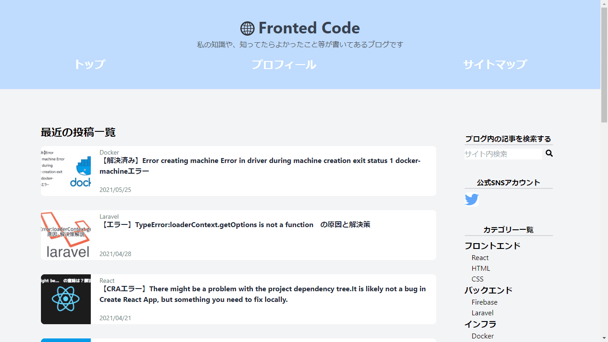
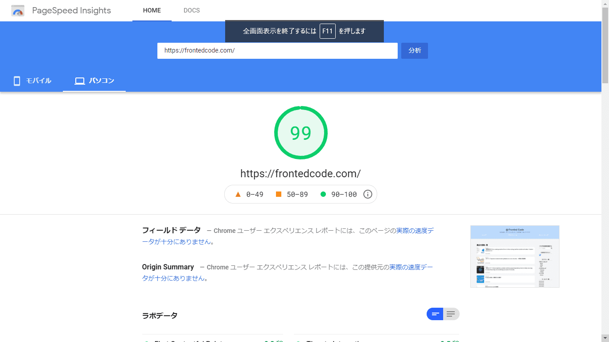

# FrontedCode

SSG ブログサイトです。
主に、独学で学んだ技術、エラーの解決策等を発信しております。

## 機能一覧

- 検索機能
- jamstack
- パンくずリスト
- レスポンシブ対応

## 使用した技術

- HTML & CSS
- Typescript
- React
  - Next.js
- Firebase
  - Authentication
  - Cloud Storage
  - Cloud Functions
- Tailwind
- Test
  - Jest
  - React-Testing-Library

## その他

[PageSpeed Insights](https://developers.google.com/speed/pagespeed/insights/?hl=JA)という、Google の web サイトの速度を測定するサービスで 99 を頂きました。
サイトの速度には自信があります。

ちなみに Netlify でデプロイしました
